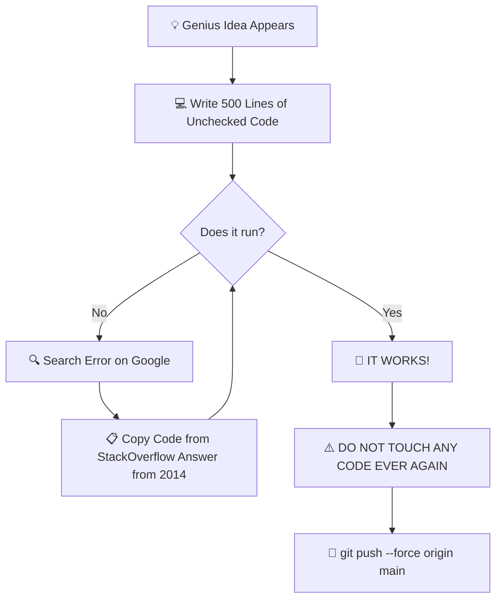

<div align="center">

<!-- Banner Image -->


<!-- Typing SVG Animation -->
<a href="https://git.io/typing-svg">
  
</a>

<br/><br/>

[](https://github.com/PMLS)
[](https://github.com/)
[](https://github.com/)
[](https://github.com/)

</div>

---

## 🤡 Who Am I? (The Unfiltered Truth)

```yaml
user_profile:
  role: "Senior Copy-Paste Architect & Full-Stack Chaos Engineer"
  experience: "Has read StackOverflow answers from 2012 and prayed they work"
  superpower: "Fixing 1 bug and spawning 14 new features... I mean, bugs."
  current_status: "Debugging code that worked yesterday for literally no reason"
  favorite_shortcut: "Ctrl + Z (Life's undo button)"
```

* 🧠 **Thinking Process**: *"It works on my machine, so it's a deployment issue."*
* 🛠️ Currently building **[Musify](https://github.com/)** — A Discord bot & Web Dashboard so epic it makes silence illegal.
* ☕ **Fuel Source**: High-grade caffeine and panic at 3:00 AM before a deadline.
* 💥 **Motto**: *"If at first you don't succeed, `rm -rf node_modules` and `npm install` again."*

---

## 🔄 My Official Development Flowchart



---

## 🎛️ Weapons of Mass Production (Tech Stack)

<div align="center">

### 💻 Languages & Frameworks


### 🗄️ Databases & Services


### 🛠️ Tools & Survival Gear


</div>

---

## 📊 Animated GitHub Flex Zone

<div align="center">

<!-- GitHub Stats Card -->

&nbsp;
<!-- Top Languages Card -->


<br/><br/>

<!-- GitHub Streak Stats -->


</div>

---

## 🐍 Contribution Snake (Eating My Midnight Commits)

<div align="center">


</div>

---

## 📜 Golden Rules of Software Engineering

> **Rule #1:** If it works, don't ask why. Just walk away slowly.
> 
> **Rule #2:** A code snippet in production is worth 100 unread documentation pages.
> 
> **Rule #3:** `console.log('HERE 1')`, `console.log('HERE 2')`, `console.log('WHY IS THIS RUNNING')` is valid debugging.
> 
> **Rule #4:** Documentation is like clean clothes — everyone wants it, nobody wants to do the laundry.

---

## 🔊 Currently Playing...

<div align="center">

```text
  [▶]  Musify Bot - High-Bitrate Lo-Fi Beats
  ━━━━━━━◯─────────────────────── 02:45 / 03:30
  ⏮️   ⏯️   ⏭️   🔀   🔁   🔊 100%
```

</div>

---

## 🤝 Let's Connect (Or Roast My Code)

<div align="center">

[](https://discord.com)
[](https://github.com)
[](https://fizzystudio.xyz)

</div>

<br/>

<div align="center">
  <sub>Made with ❤️, ☕, and unhandled promise rejections.</sub>
</div>
