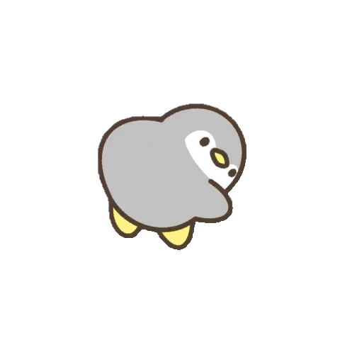

  <!-- Banner -->
  

    

  <!-- Animated Header -->
  <h1>
    
    Hi there, I'm <b>Zavian</b>
  </h1>

  <h3>Founder at <b>FizzyStudio</b></h3>

  <!-- Typing SVG Animation -->
  

    
  

  <!-- Animated Capsule Badges -->
  

    
    
    
  

 

**💡 Fun Fact**

*My Discord bots reply faster than your crush.* 😅

 

 

## ⚡ About Me

> 🤖 *"Building Discord bots so users don't have to interact with real humans."*

- 🔭 Developer from **Pakistan 🇵🇰** building Discord applications & backend services at **FizzyStudio**
- 💬 Interested in Discord ecosystems, multiplayer game bots, and server automation
- ⚡ Focused on crafting user-centric tools and backend systems

 

 

## 🚀 Featured Projects

<table width="100%">
  <tr>
    <td width="50%" valign="top">
      <h3>🎨 Guess The Drawing</h3>
      
A multiplayer Discord drawing game featuring real-time gameplay, progression system, achievements, clan features, leaderboards, and interactive commands.

      

        
        
      

    </td>
    <td width="50%" valign="top">
      <h3>🌐 GuessTheDrawing API</h3>
      
A public REST API powering the Guess The Drawing ecosystem, serving drawing content and related game resources.

      

        
        
      

    </td>
  </tr>
</table>

 

 

## 📊 GitHub Statistics

  
  &nbsp;&nbsp;
  

  

 

## 📈 Activity Graph

  

 

 

  

    

  <b>Thanks for visiting!</b> • Created for <b>FizzyStudio</b>

